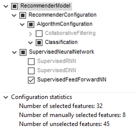
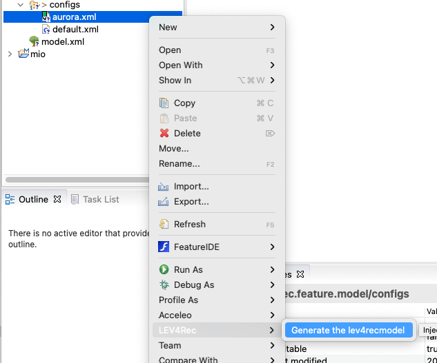
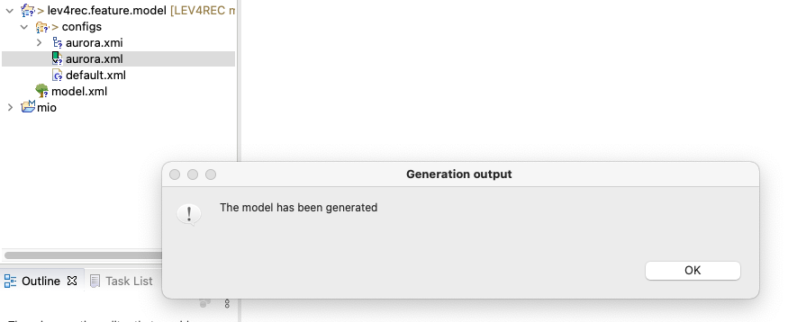
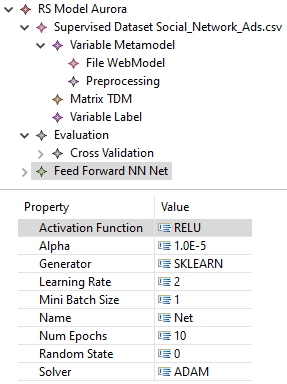

## LEV4REC environment
This folder contains the Eclipse projects to run the tool. You need to download Eclipse JEE from [here](https://www.eclipse.org/downloads/) and install the following plug-in:

 - EMF modeling tool SDK needed to edit the metamodel and models (update site [here](https://download.eclipse.org/modeling/emf/emf/builds/index.html))
 - FeatureIDE to modify the feature model directly from Eclipse Marketplace (Help > Eclipse Marketplace and then searching for FeatureIDE)
 - Acceleo to generate the source code (update site [here](https://www.eclipse.org/acceleo/download.html))

## LEV4REC structure

To extend/customize the environment, you can act on the following components

 - **lev4rec.code.generator**: this component produce the source code by using Acceleo templates
 - **lev4rec.feature.model**: it represents the feature model and the derived configuration for the two examined RSs in the study
 - **lev4.rec.model** : it contains the metamodel and the conform models 
 - **lev4rec.model.generator**: this component produce the coars-grain model from the feature configuration

 
 
## Installation
In order to install FocusRascal, please follow these steps:

1. Install an appropriate version of **Eclipse Modeling Frameworl** according to your platform/distribution from this link: [Eclipse](https://www.eclipse.org/downloads/).
2. Install [FeatureIDE](https://featureide.github.io/) plugin.
3. In Eclipse, import all the projects by navigating to `File -> Import -> Existing Projects into Workspace` and pointing the root directory to this. All projects should compile without any issue.

## Tool Usage
1. Once you import all the projects, in the **configs** folder of **lev4rec.feature.model** you can create the configuration file to specify the system's features (Right click > New > Configuration file).

2. Then next step is the generation of the LEV4REC model using the  **lev4rec.model.generator** module. The pictures below show the process:

3. Once the modeler has refined the LEV4REC model, she will generate the recommender system.

