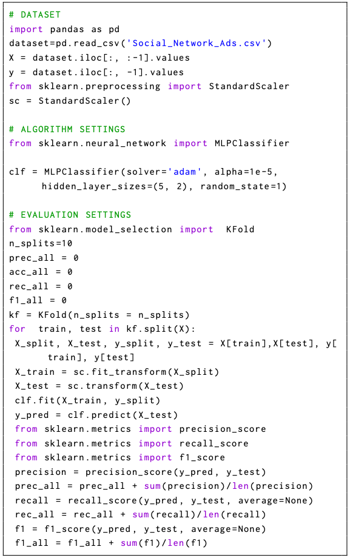

## LEV4REC environment
This folder contains the Eclipse projects to run the tool. You need to download Eclipse JEE from [here](https://www.eclipse.org/downloads/) and install the following plug-in:

 - EMF modeling tool SDK needed to edit the metamodel and models (update site [here](https://download.eclipse.org/modeling/emf/emf/builds/index.html))
 - FeatureIDE to modify the feature model directly from Eclipse Marketplace (Help > Eclipse Marketplace and then searching for FeatureIDE)
 - Acceleo to generate the source code (update site [here](https://www.eclipse.org/acceleo/download.html))

## LEV4REC structure

To extend/customize the environment, you can act on the following components

 - **lev4rec.code.generator**: this component produces the source code by using Acceleo templates
 - **lev4rec.feature.model**: it represents the feature model and the derived configuration for the two examined RSs in the study
 - **lev4.rec.model** : it contains the metamodel and the conform models 
 - **lev4rec.model.generator**: this component produces the coarse-grain model from the feature configuration

 
 
## Installation
In order to install LEV4REC, please follow these steps:

1. Install an appropriate version of **Eclipse Modeling Framework** according to your platform/distribution from this link: [Eclipse](https://www.eclipse.org/downloads/).
2. Install [FeatureIDE](https://featureide.github.io/) plugin.
3. In Eclipse, import all the projects by navigating to `File -> Import -> Existing Projects into Workspace` and pointing the root directory to this. All projects should compile without any issue.

## Tool Usage
1. Once you import all the projects, in the **configs** folder of **lev4rec.feature.model** you can create the configuration file to specify the system's features (Right-click > New > Configuration file). The figure below shows the expected configuration model:

2. Then next step is the generation of the LEV4REC model using the  **lev4rec.model.generator** module. The pictures below show the process:

Starting from the Configuration file expressed in the xml format, the system automatically generates the xmi model e.g. the Aurora model depicted in the image

By relying on the EMF editor, you can access and modify the attributes of the generated coarse-grain model:

3. Starting from the refined LEV4REC model, you can generate the recommender system.

At the end of the process, you can obtain the actual Python code that implements the specified system:

