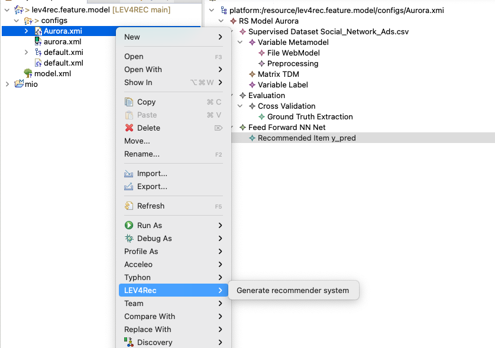
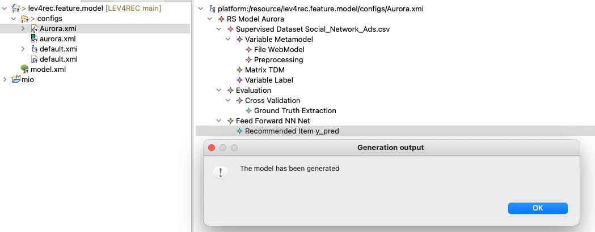

## LEV4REC environment
This folder contains the Eclipse projects to run the tool. You need to download Eclipse JEE from [here](https://www.eclipse.org/downloads/) and install the following plug-in:

 - EMF modeling tool SDK needed to edit the metamodel and models (update site [here](https://download.eclipse.org/modeling/emf/emf/builds/index.html))
 - FeatureIDE to modify the feature model directly from Eclipse Marketplace (Help > Eclipse Marketplace and then searching for FeatureIDE)
 - Acceleo to generate the source code (update site [here](https://www.eclipse.org/acceleo/download.html))

## LEV4REC structure

To extend/customize the environment, you can act on the following components

 - **lev4rec.code.generator**: this component produce the source code by using Acceleo templates
 - **lev4rec.feature.model**: it represents the feature model and the derived configuration for the two examined RSs in the study
 - **lev4.rec.model** : it contains the metamodel and the conform models 
 - **lev4rec.model.generator**: this component produce the coars-grain model from the feature configuration

## Bundles installation
Once you have downloaded and installed Eclipse IDE, you have to import **lev4rec.feature.model** project into the workspace (File>Import Projects from File System). 
Then, in the **configs** folder you can create the configuration file to specify the system's features (Right click > New > Configuration file).
The next step is the generation of the LEV4REC model using the  **lev4rec.model.generator** module. The picture below shows the process:

