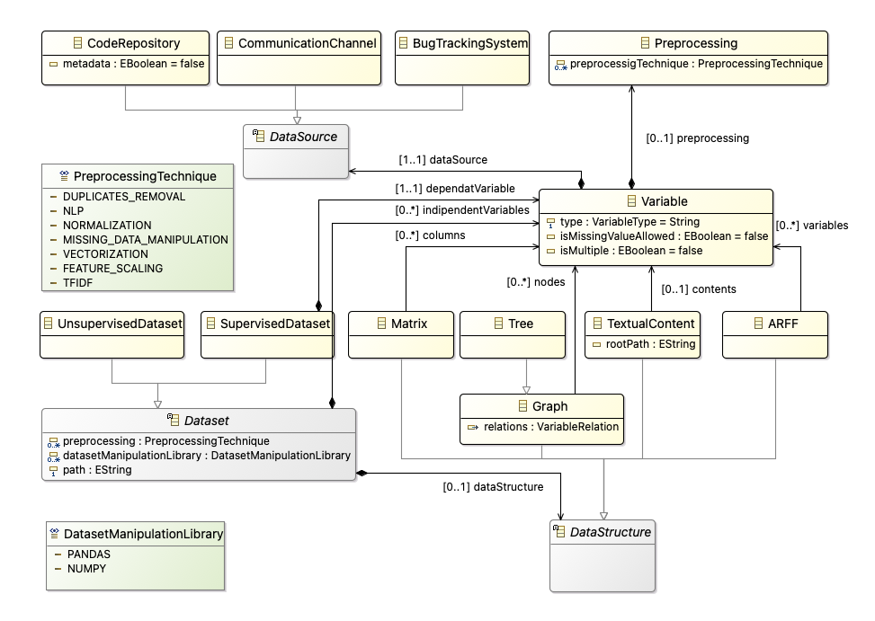
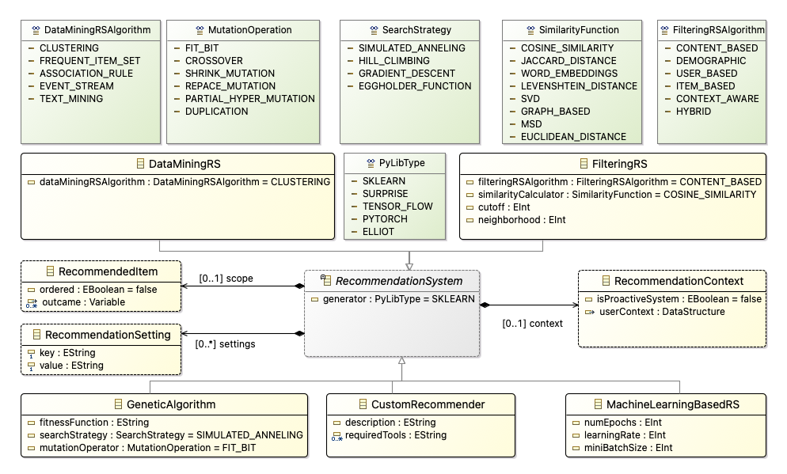
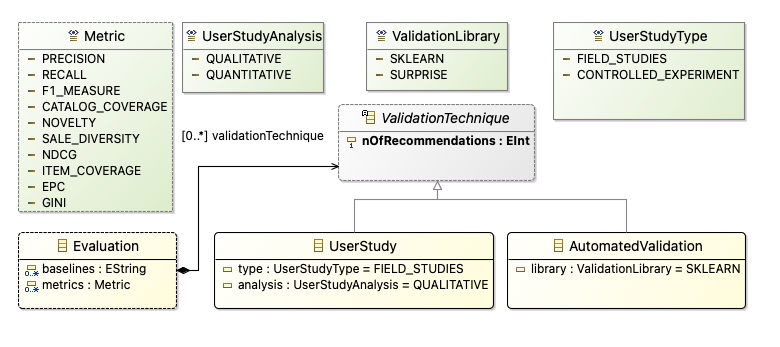
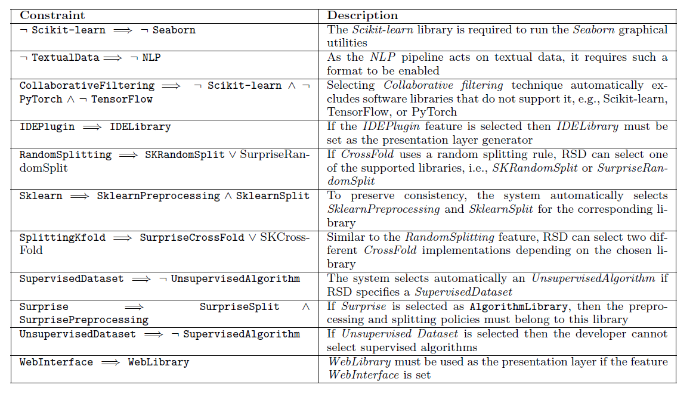
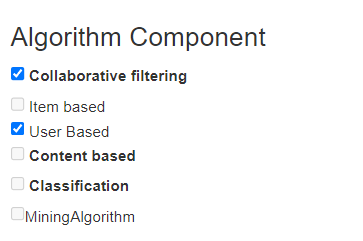
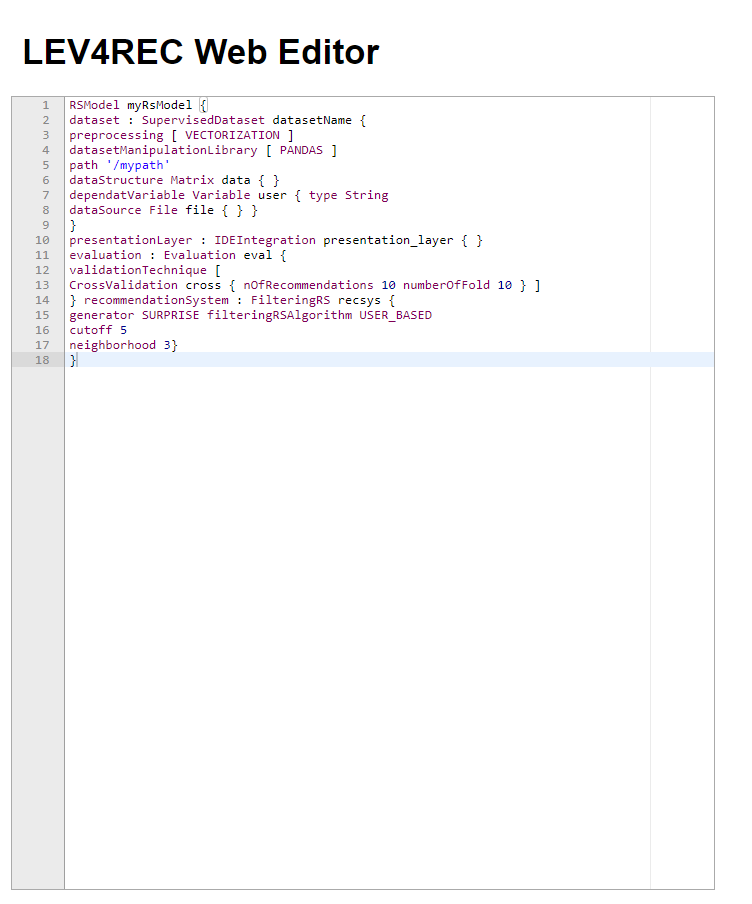
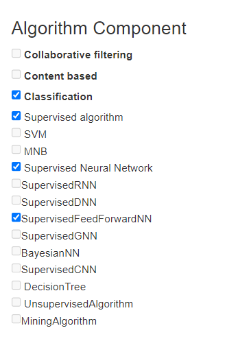
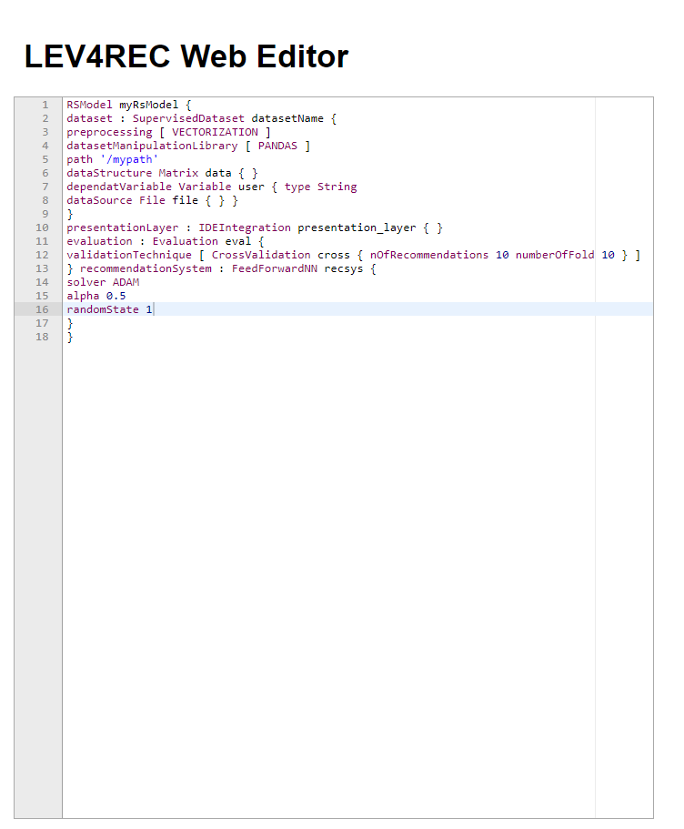

# LEV4REC Domain Syntax Language (DSL)

This document provides a brief overview of the conceived domain syntax language (DSL) used to define a generic recommender system. The grammar has been generated from the LEV4REC RS Metamodel using the Eclipse [Xtext](https://www.eclipse.org/Xtext/index.html) framework. The conceived grammar adheres to the [Xtext grammar language](https://www.eclipse.org/Xtext/documentation/301_grammarlanguage.html) that allows the definition of custom entities and meta-concepts. For the sake of presentation, we refer to the DSL as RsDsl throughout this document.    

## List of functions and features:

- RsDSL enables the specification of the wanted recommender systems by using the defined meta-concepts in the RS metamodel.
- RsDSL enables the specification of the system by means of a textual syntax.
- RsDSL editor supports syntax highlighting, auto-complention, error markers, and auto-formatting features which are provided by the [Ace Javascript library](https://ace.c9.io/)

## RsDsl concepts

All concepts and entities used by the RsDsl grammar are inherited from the RS metamodel. In particular, *RsModel* is the root element that contains the four main components of the system, i.e., *Dataset*, *RecommendationSystem*, *Evaluation*, and *PresentationLayer*. The user can specify attributes and relationships by using the textual grammar embedded in the web editor. We report the list of primitive types used to specify two different types of recommender systems, i.e., a KNN-based algorithm and an ML-based classifier. Therefore, this document contains a subset of all the primitive types. The interested reader can have a look at [RsDsl.xtext](https://github.com/MDEGroup/LEV4REC-Tool/blob/main/lev4rec/bundles/org.xtext.lev4rec.parent/org.xtext.lev4rec/src/org/xtext/lev4recgrammar/first/RsDsl.xtext) file, where the whole grammar is specified. The list of the core primitive classes has been defined as follows:
    
    - RsModel
        - Dataset
            - DataStructure
        - RecommendationSystem
        - Evaluation
        - PresentationLayer

For each core component, we have the following sub-classes:

    - UnsupervisedDataset->Dataset 
    - SupervisedDataset->Dataset 

    - FilteringRS->RecommendationSystem
    - FeedForwardNN->RecommendationSystem
    - Matrix-> DataStructure
    - Variable
    - WebApplication -> PresentationLayer
    - RawOutcomes -> PresentationLayer
    - JupyterNotebook -> PresentationLayer

    

where the -> is the superClass relation. Furthermore, we have the following enumerations 

        - DatasetManipulationLibrary
            - PADAS
            - NUMPY
        - VariableType
            - String 
            - Boolean 
            - CategoricalData 
            - Integer 
            - Float 
        - ValidationLibrary
            - SKLEARN
            - SURPRISE
        - FilteringRSAlgorithm
            - CONTENT_BASED
            - DEMOGRAPHIC
            - USED

        - PreprocessingTechnique
            - DUPLICATES_REMOVAL 
            - NLP 
            - NORMALIZATION 
            - MISSING_DATA_MANIPULATION 
            - VECTORIZATION 
            - FEATURE_SCALING 

The complete set of entities, including the conceived grammar rules, are defined in the. It is worth noting that all the source code can be automatically generated from this file by doing:

` Right click > Generate Xtext artifacts `

It is worth mentioning that not all the listed primitive types have a corresponding implementation in the generated code. Nevertheless, the Docker version of the tool is expressive enough to cover two use cases presented later in this document. 

## RS metamodel

All the concepts that can be expressed by the RsDsl derive from the [RS metamodel](https://github.com/MDEGroup/LEV4REC-Tool/blob/main/use_case_artifacts/LEV4REC_meta_model.png). For the sake of presentation, we list below each sub-component of the system and the corresponding meta-classes: 

` DataStructure entities `

` RecommenderSystem entities `

` Evaluation entities `

It is worth noting that not all the metaclasses have the corresponding implementation in the Acceleo templates. Nevertheless, the use cases presented in the paper are fully covered.   

## RS Constraints

For each component, we conceive a set of logical constraints that drives the user during the design phase. The constraints refer to the [RS feature model](https://github.com/MDEGroup/LEV4REC-Tool/blob/main/use_case_artifacts/LEV4REC_feature_model.png). The constraints and a short description are defined as follows:

## Generate the Web Editor

The web editor has been automatically generated from the Xtext project. To this end, we follow the steps provided by the [Xtext official documentation](https://www.eclipse.org/Xtext/documentation/330_web_support.html).

## RsDsl Usage
The following section describes the usage of the RsDsl using the Docker installation of LEV4REC. 

### Replicating the use cases

#### Filtering Algorithm

Using the RS Configuration Form, the user can specify the KNN algorithm as follows: 

Afterward, the user can fine-tune the specification by adding additional parameters. The whole KNN settings should be similar to the following:

### ML-based approach

The procedure can be followed to AURORA, a classification approach based on a feed-forward neural network. 

First, the user can select the proper type of network from the RS Configuration form:

Once all the components have been selected, LEV4REC generates automatically the DSL string that the user can customize:

### Acceleo Templates

Once the user has enhanced the system's specification using the web editor, the corresponding implementation can be generated by using the 'Generate' button available in the form. We employ a dedicated Acceleo template [ generate.mtl ](https://github.com/MDEGroup/LEV4REC-Tool/tree/main/lev4rec/bundles/lev4rec.code.template/src/lev4rec/code/template/main) file that has been feed directly with the DSL string contained in the form.  

